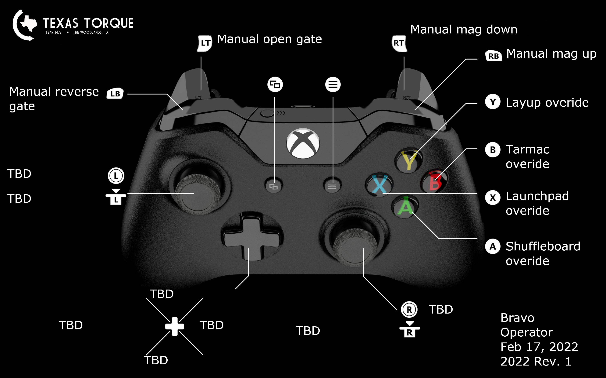

# TexasTorque2022

Texas Torque's main robot code for the 2022 Rapid React season!

## Controls

### Driver

### Operator

## Formatting

To acquire the formatter in VSCode, download [this extension](https://marketplace.visualstudio.com/items?itemName=redhat.java).

Then, go to `Settings -> Text Editor -> Formatting` and enable "Format on Paste" and "Fromat on Save". Additionally, search for "default formatter" and select "Language Support for Java(TM) by Red Hat".

## Contributing

Before you do anything, check the project board and issues tab. If you are adding a new feature, create a new issue. Pull requests are enforced to write to master. Create a branch, named as a description of the changes made in the branch, and push your changes to it. From GitHub, create a pull request to merge into master. In your pull request, write a description of changes, and link the issue(s) you are addressing using "Closes #1477" (with the actual number of the issue). After creating the PR, request review. The PR will either be approved or rejected, deleting the branch, or changes will be requested from the review.
